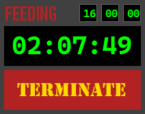
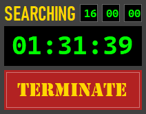
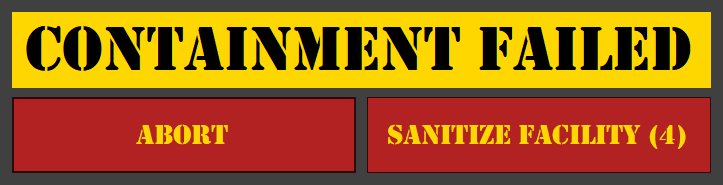

# Zombie

Have an IT department that knows how to set the screen lock time out through group policy but doesn't care to track any more than that? Zombie is for you. It's a simple Windows Forms application that will keep your computer from locking the screen by simulating a key press every 30 seconds. Not that I would recommend using it. That would probably be against organization policy. And that would be bad.

When the countdown timer ends:

Abort to kill the process, Sanitize Facility to shut down the computer.

## Usage

1. Download
2. Build
3. Run
4. ???
5. Profit
