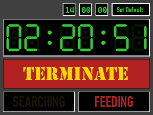
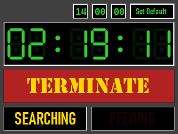
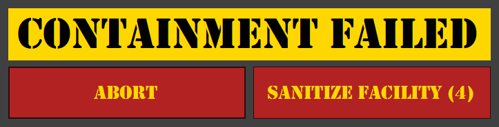

# Zombie

Have an IT department that knows how to set the screen lock time out through group policy but doesn't care to track any more than that? Zombie is for you. It's a simple Windows Forms application that will keep your computer from locking the screen by simulating a key press every 30 seconds. Not that I would recommend using it. That would probably be against organization policy. And that would be bad.

## Usage

1. Download
2. Build
3. Run
4. ???
5. Profit

## Interface

The application starts minimized to the system tray. Double-click the icon to open the main dialog.

The main dialog has a start time, an end time, and a button to terminate the application. Out of the box, then default ending time is 14:00 because that's what works for me when working for an east coast company from the west coast. To change the default ending time through the application, change the hour, minute, and second values in the text boxes, then click the "Set Default" button. The system will update the default end time and save it to the application's settings file. If, for some reason, you feel the need to update the default manually, you can find the settings file in the application's directory at `Zombie.dll.config`. The relevant settings are `defaultHour`, `defaultMinute`, and `defaultSecond`.

You can also set the end time for the current session by changing the hour, minute, and second values in the text boxes. The remaining time will update automatically as you change the values. I haven't had a need to set the end time more than 24 hours in advance, so the application attempts to interpret the time input as the next occurrence of that time. The timer cannot be set to a time in the past, nor can it be set more than 24 hours in the future.

The application has two modes: Feeding and Searching. Feeding mode monitors the cursor position for movement every 30 seconds. If movement is detected, it stays in Feeding mode and resets the timer. If no movement is detected, it switches to Searching mode and simulates a key press every 30 seconds. Searching mode monitors for mouse movement and simulates a key press if no movement is detected for 30 seconds.

The feeding and searching intervals are configurable in the application's settings file. The relevant settings are `feedingInterval` and `searchingInterval`. The default values are 30,000 milliseconds for both.

When the end time is reached, the application will display an alert dialog with the message "Containment Failed" and two buttons: Abort and Sanitize Facility.

Abort kills the process, Sanitize Facility shuts down the computer. There is a five-second timer on the Sanitize Facility button to prevent accidental shutdowns. When the timer ends, the machine shuts down without further warning.

## License

Meh. With the exception of the icon, I don't care. Do what you want with it. Just don't blame me if you get in trouble. So, I guess, Public Domain? Sure. Let's go with that.

Seriously, though, don't use this at work. It's a bad idea.

The icon is my own work and is licensed under the Creative Commons Attribution-ShareAlike 4.0 International license. You can find the icon in the `res` directory.
